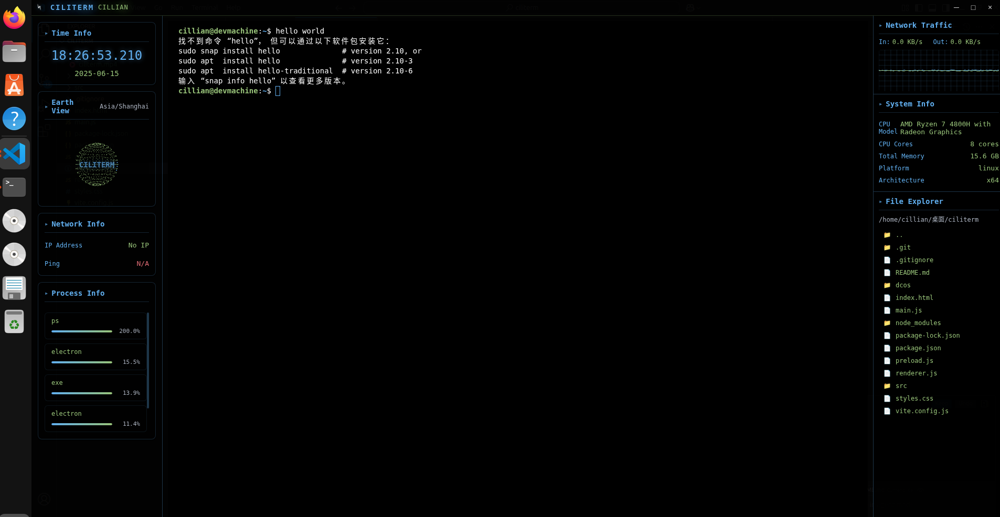

# CILITERM

CILITERM 是一个现代化的跨平台终端模拟器，基于 Electron 和 Vue3 构建，集成了系统监控、文件浏览、网络流量可视化、3D 地球动画等功能。

CILITERM is a modern cross-platform terminal emulator built with Electron and Vue3, featuring system monitoring, file browsing, network traffic visualization, and a 3D globe animation.




<video controls src="dcos/ciliterm.mp4" title="Title"></video>
---

## 功能 Features
- 终端模拟与命令行交互
- 系统信息实时监控（CPU、内存、网络、磁盘等）
- 文件浏览器
- 网络流量波形图
- 进程信息展示
- 3D 地球与卫星动画

- Terminal emulation and command-line interaction
- Real-time system monitoring (CPU, memory, network, disk, etc.)
- File explorer
- Network traffic waveform visualization
- Process information display
- 3D globe and satellite animation

---

## 安装与运行 Installation & Usage

### 依赖 Dependencies
- Node.js >= 16
- npm >= 8
- Electron >= 36

### 安装 Install
```bash
npm install
```

### 启动 Start
```bash
npm start
```

### 构建 Build
```bash
npm run build
```

---

## 目录结构 Project Structure
```
ciliterm/
├── index.html           # 主页面 Main HTML
├── main.js              # Electron 主进程 Main process
├── preload.js           # Electron 预加载脚本 Preload script
├── renderer.js          # 渲染进程逻辑 Renderer logic
├── styles.css           # 全局样式 Global styles
├── package.json         # 项目配置 Project config
├── vite.config.js       # Vite 配置 Vite config
├── src/
│   ├── App.vue          # Vue 主组件 Main Vue component
│   ├── main.js          # Vue 入口 Entry
│   └── styles/          # 组件样式 Component styles
└── ...
```

---

## 贡献 Contribution
欢迎提交 issue 和 PR，完善功能或修复 bug

Contributions are welcome! Feel free to submit issues and pull requests.

---

## License
AGPL-3.0-only

---

如有问题请联系作者
For any questions, please contact the author.
