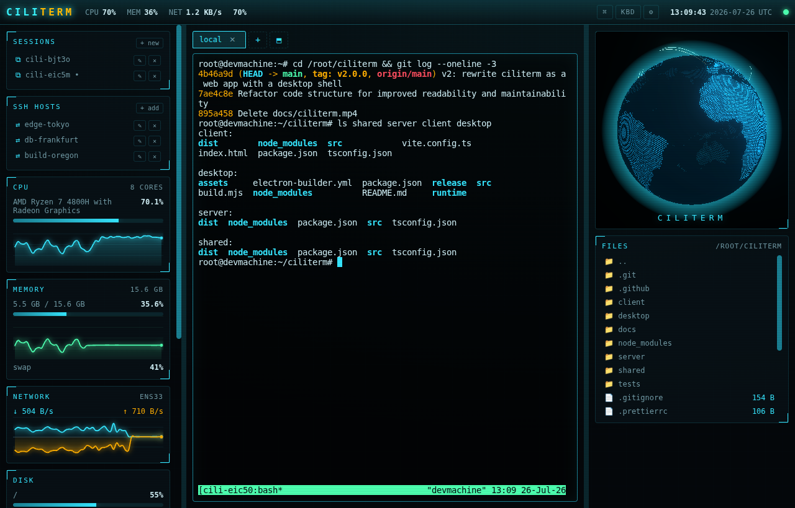

# ciliterm

A web-first, daily-driver **sci-fi terminal** in the spirit of
[eDEX-UI](https://github.com/GitSquared/edex-ui), with a TRON / ENCOM-style
glowing hex globe (inspired by [encom-globe](https://github.com/arscan/encom-globe)).

The terminal is first-class (real shell, tabs, split panes, search, reconnect,
persistent sessions, SSH manager). The globe, system monitors and on-screen
keyboard are optional, toggleable eye-candy that never get in the way.

This is a full rewrite of the earlier Electron+Vue3 ciliterm as a
React + Vite + TypeScript web app backed by a Node + TypeScript server.
It runs in a browser, and ships as a desktop app for Linux, macOS and Windows
that wraps the exact same server and client.



## Download

Installers for Linux, macOS and Windows are on the
[releases page](https://github.com/ciliverse/ciliterm/releases/latest). They are
unsigned, so first launch needs one extra step on macOS and Windows — see
[`desktop/README.md`](desktop/README.md).

## Features

- **Real terminal** over `node-pty` (xterm.js + WebGL renderer): tabs, up to
  3-way split panes, in-terminal search (`Ctrl/Cmd+F`), web links, auto-reconnect.
- **Persistent sessions** — uses system `tmux` when available
  (`tmux new -A -s`), so sessions survive reloads, disconnects and even server
  restarts. Falls back to an in-process long-lived pty with an output ring
  buffer when tmux is absent.
- **SSH connection manager** — saved hosts in `~/.config/ciliterm/hosts.json`,
  one-click connect via the system `ssh` (key / ssh-agent auth; no passwords stored).
- **Live system monitors** (real data via `systeminformation`): CPU, memory,
  network in/out, disk usage, top processes, host/OS/IP, latency, clock.
- **File browser** that follows the active terminal's working directory; click a
  file to insert its path into the focused terminal.
- **ENCOM globe** — modern three.js + three-globe hex continents, glowing arcs,
  satellites and Unreal bloom. Pauses when the tab is hidden; optional low-power mode.
- **TRON theme**, collapsible panels, persisted settings (font, size, panels,
  polling interval).

## Architecture

Monorepo (pnpm workspace):

- `shared/` — `@ciliterm/shared`: the wire protocol (TS types + zod), the single
  source of truth for all client/server messages.
- `server/` — `@ciliterm/server`: Express + `ws`. Endpoints `/pty`, `/control`, `/sys`.
- `client/` — `@ciliterm/client`: React + Vite. Terminal + panels. A `Transport`
  abstraction decouples the UI from the wire.
- `desktop/` — `@ciliterm/desktop`: the Electron shell. Runs the bundled server
  as a sidecar on an ephemeral loopback port and points a window at it.

## Requirements

- Node.js >= 20, pnpm
- A C/C++ toolchain for building `node-pty` (`build-essential` on Debian/Ubuntu)
- Optional but recommended: `tmux` (for true session persistence)
- Optional: OpenSSH client (`ssh`) for the SSH manager

## Getting started

```bash
pnpm install
pnpm dev
```

`pnpm dev` builds `shared`, then runs the backend (`http://127.0.0.1:8787`) and
the Vite dev server (`http://localhost:5273`, which proxies `/pty`, `/control`,
`/sys` to the backend). Open the Vite URL.

## Production

```bash
pnpm build      # builds shared -> client -> server
pnpm start      # serves client/dist and the WebSocket API on :8787
```

Bound to `127.0.0.1` (the default) the port is only reachable from this machine,
so it just opens at `http://127.0.0.1:8787` with no token.

Once you expose it on a non-loopback host (e.g. `CILITERM_HOST=0.0.0.0`) or set
`CILITERM_TOKEN`, a `?token=` secret is enforced on every WebSocket upgrade and
the server prints a launch URL that includes it:

```
[ciliterm] open this URL (token required):
           http://0.0.0.0:8787/?token=<hex>
```

Open that URL once — the client stores the token in `localStorage` and strips it
from the address bar, so later visits just work.

## Desktop app

```bash
pnpm desktop          # build everything and launch the Electron shell
pnpm desktop:linux    # AppImage + deb
pnpm desktop:mac      # dmg + zip (arm64, x64)
pnpm desktop:win      # NSIS installer + portable exe
```

The desktop build is a thin wrapper, not a fork: Electron runs the same server
as a child process (`ELECTRON_RUN_AS_NODE`, so no second Node runtime is
shipped) on an OS-assigned loopback port, then opens a window on it. SSH hosts
stay in the shared `~/.config/ciliterm/`, so the browser and desktop versions
see the same host book.

Because a terminal owns the `Ctrl` chord space, the desktop menu uses
`Ctrl+Shift+C` / `Ctrl+Shift+V` for copy and paste on Windows and Linux and
leaves `Ctrl+C`, `Ctrl+R`, `Ctrl+W` and friends to the shell. macOS keeps the
usual `Cmd` shortcuts. Builds are unsigned — see
[`desktop/README.md`](desktop/README.md) for the first-launch steps, packaging
details and troubleshooting.

## Tests

```bash
pnpm test       # vitest: protocol/zod, layout, formatters, IP filter, ssh command
```

## Configuration

Environment variables (server):

- `CILITERM_HOST` (default `127.0.0.1`)
- `CILITERM_PORT` (default `8787`)
- `CILITERM_SHELL` (default `$SHELL` or `bash`; on Windows, `powershell.exe` —
  `$SHELL` is ignored there because Git Bash and MSYS2 set it to a Unix path)
- `CILITERM_CONFIG_DIR` (default `~/.config/ciliterm`)
- `CILITERM_CLIENT_DIST` — where to serve the web client from (default: the
  sibling `client/dist`; the desktop build points this into its own resources)
- `CILITERM_TOKEN` — set a fixed WebSocket auth token (also force-enables auth)
- `CILITERM_NO_AUTH=1` — force-disable the token check
- `CILITERM_DESKTOP=1` — set by the Electron shell: report the bound port on
  stdout instead of printing a launch URL, and exit if the parent process dies

## Security

The `/pty` endpoint is direct access to a shell on the host. The server binds to
`127.0.0.1` only by default, where the port is reachable solely from this machine
(the same threat model as any local shell), so no token is required there. As soon
as it is exposed on a non-loopback host — or `CILITERM_TOKEN` is set — every
WebSocket upgrade requires the `?token=` secret (constant-time compared). If you
expose it beyond localhost, keep auth on and put TLS in front of it. Only key /
ssh-agent auth is used for SSH; passwords are never stored.

## Roadmap (not yet implemented)

- Signed and notarised desktop builds (they are unsigned today)
- SSH password login with local encryption, tunnels/port-forwarding, sftp panel
- Sound effects, multiple themes, custom keyboard layouts

## License

AGPL-3.0-only
